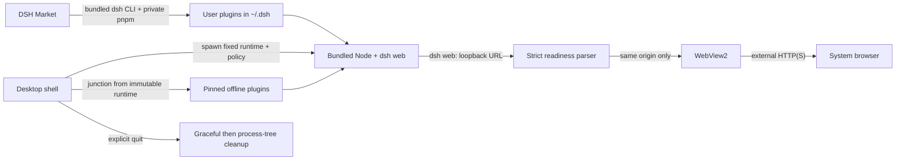

# DeepSeek Harness Desktop

<p align="center">
  <a href="README.md">简体中文</a> · <strong>English</strong>
</p>

<p align="center">
  
</p>

<p align="center">
  A self-contained DeepSeek Harness desktop wrapper for Windows, built around explicit lifecycle management and security boundaries.
</p>

<p align="center">
  <a href="https://dsh.cubee.chat/">Website</a> ·
  <a href="https://github.com/licn9901-arch/DSH-Desktop/releases">Download</a> ·
  <a href="https://github.com/licn9901-arch/DSH-Desktop/releases"></a>
  <a href="LICENSE"></a>
</p>

> [!IMPORTANT]
> This is a community-maintained project. It is not an official DeepSeek product and does not represent DeepSeek.

## Download and Install

Project website: [https://dsh.cubee.chat/](https://dsh.cubee.chat/)

Download the latest `DeepSeek Harness Desktop_*_x64-setup.exe` from
[GitHub Releases](https://github.com/licn9901-arch/DSH-Desktop/releases) and run the installer. Preview builds support only Windows 10 22H2 and Windows 11 on x64.

`v0.1.0-preview.11` is not Authenticode-signed, so Windows SmartScreen may identify it as coming from an unknown publisher.
Before running the installer, verify it against the matching `.sha256` file on the Release page.

The installer includes Node.js `22.22.3`, `@deepseek-ai/dsh 0.1.0-rc.6`,
`dshmarket 1.10.0`, and `pnpm 10.34.5`. The first launch works offline and does not require a separate Node, DSH, pnpm, or official DeepSeek desktop installation.

## Features

- Starts a local `dsh web` instance and loads it in WebView2 only after validating its loopback address.
- Enforces a single instance: launching the app again restores and focuses the existing window instead of creating a second Host.
- Closing the main window hides it in the system tray while tasks continue running; only **Quit** from the tray shuts down the Host.
- Restarts the DSH service serially from the tray and restores the WebView after the new PID and random port become ready.
- Waits up to five seconds for a normal Host exit, then force-terminates only the process tree recorded by this application.
- Opens external HTTP/HTTPS links in the system browser and rejects dangerous schemes and cross-origin WebView navigation.
- Grants no Tauri capabilities to Host pages; the local startup page uses a strict CSP.
- Logs timestamps, levels, and PIDs with sensitive-field redaction and `5 MiB x 3` rotation.

## Bundled Plugins

`v0.1.0-preview.11` pins and delivers the following plugins offline. The desktop app manages only marker-owned installations. It does not overwrite same-name plugins installed by the user and preserves plugins the user has disabled.

| Plugin | Version | Default behavior and permissions |
|---|---:|---|
| [`dsh-at-file`](https://github.com/omdsh-dev/dsh-at-file) | 0.6.0 | Searches workspace paths and inserts only relative path references, never file contents |
| [`@omdsh-dev/dsh-genui`](https://github.com/omdsh-dev/dsh-genui) | 0.8.4 | Renders GenUI, Mermaid, and Three.js locally; actions are sent back to the model as messages |
| [`dsh-better-sidebar`](https://github.com/omdsh-dev/DSH-better-sidebar) | 0.12.2 | Can access files, Git, and the local PTY; model terminal tools remain disabled, and HTTP/HTTPS takeover is disabled on the first managed install |
| [`@linxin666/dsh-client-ui-skin-center`](https://github.com/zhu1090093659/dsh-web-ui/tree/main/packages/skins/skin-center) | 0.2.2 | Ships every skin in one package without the retired `dsh-skins` carrier or the full Web UI suite; themes can be previewed, applied, and restored live without restarting the Host |
| [`@vectorize-io/hindsight-coding-agents`](https://github.com/vectorize-io/hindsight/tree/main/hindsight-integrations/coding-agents) | 0.3.4 | The **Project Memory** settings page configures cloud or self-hosted services, credentials, and project opt-in; projects that are not enabled are neither recorded nor uploaded |
| [`@liustack/modlens`](https://github.com/liustack/modlens) | 3.16.7 | Provides image reading and structured vision results; no API key, vision endpoint, or Agent CLI is preconfigured |
| [`@cubee-slide/skills-mcp-manager`](https://www.npmjs.com/package/@cubee-slide/skills-mcp-manager) | 0.2.4 | Long-term desktop-maintained build with Skin Center semantic theming and compact Skills/MCP controls; MCP configuration is JSON-only, and `env`/`headers` are stored in plaintext at `~/.dsh/mcp.json` |

The desktop-owned `@dsh-desktop/settings` package provides the **Bundled Plugins** and **Project Memory** settings pages; themes now live exclusively in the independent **Skin Center**. The settings package is installed by default but may be uninstalled, and restarts or upgrades do not restore it. Reinstalling it reuses the existing user configuration. **Bundled Plugins** toggles only allowlisted package bundles. It does not uninstall files, modify dependencies, or invoke pnpm. Changes take effect after selecting **Restart DSH Service** from the tray. Official bundles, Market, and startup-critical components such as Runtime Services cannot be disabled, and unknown user bundles are left unchanged.

On first launch, the pinned GenUI `SKILL.md` is written to `$DSH_HOME/skills/genui/SKILL.md` and applies only to DSH. An unmanaged file with the same name is never overwritten. An unmodified managed file follows desktop upgrades, while user edits or deletion are preserved.

DSH Market `1.10.0` is pinned under its original package name as a desktop runtime bundle. It is not written to the user profile dependencies and cannot be upgraded or removed through Market. Market searches the curated registry and uses the bundled DSH CLI and private pnpm to install, update, and remove user plugins under `~/.dsh/profiles/web`. The bundled snapshot can be browsed offline, but installation, updates, and reliable version checks require network access.

Protected Runtime Services load before Market and always use the bundled pnpm `10.34.5`. Only when pnpm explicitly reports an incompatible historical modules/hoist major does the desktop app take byte-for-byte snapshots of the control files, atomically back up the old dependency tree, rebuild once, and retry the original operation once. A failed rebuild or retry restores the previous state. This process never uses `--force`, a global pnpm installation, or another pnpm major. Side effects created outside the profile by third-party install scripts are outside this transaction boundary.

Third-party plugins have the same Host permissions as the desktop application. Package signature verification, permission manifests, and process-level sandboxing are not currently available. Prebuilt npm packages can be installed directly. GitHub sources that require `prepare`, `allowBuilds`, or similar scripts must be explicitly approved package by package. When a plugin requires a restart, use **Restart DSH Service** from the tray; desktop policy disables Market's internal restart path.

## How It Works



The application runs the following command and lets the operating system allocate an available random port:

```text
node --expose-internals <bundled-dsh>/lib/bin.js web --patch <desktop-policy> --host 127.0.0.1 --port 0
```

After the core `webServer` and `webRuntime` become available, the desktop adapter emits `dsh desktop-core: ` and the shell navigates immediately. After all Loader plugins finish, upstream emits `dsh web: ` and the plugin transaction is committed. An older Host that emits only `dsh web: ` is treated as having reached both readiness stages. Both signals accept only an HTTP address with a loopback host and a valid explicit port, with no credentials, path, query, or fragment. Conflicting addresses terminate startup.

## Relationship to Upstream Projects

This repository maintains only the Tauri desktop shell, process lifecycle, self-contained runtime, logging, security boundaries, and Windows release workflow. It does not modify the DSH Web UI or the Agent's core capabilities. DSH, DSH Market, pnpm, and the Web frontend are pinned in `runtime.lock.json` and remain subject to their respective upstream licenses.

## Develop from Source

Requirements: PowerShell 7, Node.js `22.22.3`, Rust `1.94.1`, MSVC C++ Build Tools, and WebView2.

```powershell
git clone https://github.com/licn9901-arch/DSH-Desktop.git
Set-Location DSH-Desktop
npm ci
.\dev.cmd
```

Development builds support the following overrides. Release builds ignore Node and CLI overrides and use only the bundled runtime:

| Environment variable | Purpose |
|---|---|
| `DSH_DESKTOP_NODE_EXECUTABLE` | Development only: selects the Node executable |
| `DSH_DESKTOP_CLI_ENTRY` | Development only: selects the DSH `lib/bin.js` entry point |
| `DSH_DESKTOP_CWD` | Sets the Host working directory; defaults to the user's home directory |
| `DSH_DESKTOP_USER_HOME` | Development only: overrides the third-party user configuration directory for isolated smoke tests |
| `DSH_DESKTOP_CORE_READY_TIMEOUT_SECS` | Core page readiness timeout in seconds; defaults to 60 |
| `DSH_DESKTOP_PLUGIN_READY_TIMEOUT_SECS` | All-plugins readiness timeout in seconds; defaults to 30 |
| `DSH_DESKTOP_READY_TIMEOUT_SECS` | Legacy compatibility setting and fallback for both timeouts above |

### Build a Self-Contained Installer

```powershell
npm ci
npm run build
```

`npm run build` now uses the payload packaging path. `build:legacy` remains available for regression and upgrade validation:

```powershell
npm run package:payload
npm run verify:payload
npm run build:payload
```

The default `build` command remained on legacy for `preview.8` and `preview.9`, and both public payload previews passed the complete release gate. `preview.10` now switches the default build to payload while retaining `build:legacy` for regression coverage. Preview.7 remains only the fixed-SHA-256 legacy upgrade baseline and does not count toward payload rollout. Preview.10 passed the 6/6 upgrade matrix and two forced reproducibility builds; its final installer is 87.56 MiB. Across 20 paired installed-build warm starts, legacy P95 was 11,628 ms and payload P95 was 9,707 ms, below the 12,210 ms limit. The legacy staging path remains until one more stable preview passes.

The build downloads and verifies the official Node archive plus the npm integrity values for DSH, Market, and pnpm according to `runtime.lock.json`. It also verifies the archives and npm integrity values for nine managed bundles and one managed Skill according to `plugins.lock.json`. Each of the three pinned lockfiles is installed independently with `npm ci`; the plugin group additionally uses `--omit=dev --ignore-scripts`. Tauri packaging begins only after Node, the DSH CLI, Web frontend, plugin-local assets, PTY, and licenses have all been verified.

Staged resources are written to the Git-ignored `src-tauri/resources` directory. NSIS installers are emitted under `src-tauri/target/release/bundle/nsis`.

See [Desktop Runtime and Installer Optimization](docs/runtime-packaging-optimization.md) for Host prebundling, dependency pruning, the single pnpm 10 toolchain, ZIP payloads, atomic provisioning, and rollout state.

With an existing cache, resources can be staged offline:

```powershell
pwsh -NoProfile -File .\scripts\stage-runtime.ps1 -Offline
pwsh -NoProfile -File .\scripts\stage-plugins.ps1 -Offline
```

## Tests and Quality Gates

```powershell
npm run validate:icons
npm run lint
npm test
npm audit
Push-Location runtime-host
npm audit --omit=dev
Pop-Location
Push-Location plugin-runtime
npm audit --omit=dev
Pop-Location
npm run coverage
npm run smoke
npm run smoke:startup
# For complete preview gate arguments, see docs/testing.md
npm run release:gate -- -LegacyInstaller '<preview.7 installer>' -PayloadInstaller '<current payload installer>'
```

The coverage gate requires at least 80% line coverage across the core Host, runtime, lifecycle, navigation, logging, and readiness modules. Windows smoke tests cover application assembly. See [Testing Guide](docs/testing.md) for scope and procedures.

## Logs and Troubleshooting

Logs are stored at `%LOCALAPPDATA%\dsh-desktop\dsh-desktop.log`.

- Startup failure: inspect `level=ERROR`, the Host PID, and the actual exit code in the log.
- Market reports **Status unknown**: the registry or version check failed; this does not mean the installed version is current.
- Plugin changes do not take effect: select **Restart DSH Service** from the tray instead of relying on Market's internal restart.
- Bundled plugin toggles: open **Settings > Bundled Plugins**. Restart DSH from the tray after saving changes.
- Project memory: open **Settings > Project Memory**. Configure the service and token, enable only the projects that need memory, and restart DSH.
- Skills and MCP: open **Settings > Skills & MCP**. Configure MCP services through the unified JSON editor.
- Theme switching: open the independent **Skin Center**. The settings package no longer registers the retired **Themes** page or a Skin Center container.
- Tasks continue after the window closes: closing to the tray is expected. Reopen the window from the tray or quit explicitly.
- The build reports missing runtime/plugin files or a hash mismatch: do not bypass verification. Clear the corresponding `.runtime-cache` entry and stage it again.
- The installer reports an unknown publisher: this preview is unsigned. Verify the SHA-256 supplied with the Release before continuing.

## Updates and Uninstallation

Automatic updates are not available in the initial release. Install newer versions manually from GitHub Releases, or install an earlier preview to roll back. The uninstaller always removes the desktop-managed runtime. It removes the remaining desktop shell logs and LocalAppData only when **Delete application data** is selected. It never deletes `~/.dsh`, DSH sessions, user plugins, or business configuration.

## Current Limitations

- Windows x64 only; macOS, Linux, and ARM64 are not supported.
- No automatic updates, startup-at-login option, plugin signature verification, permission sandbox, mobile remote control, or Channels.
- In-place upgrades from the existing local `0.1.0` prototype are not guaranteed. Uninstall the prototype while preserving user data before testing preview builds.

## Contributing

Read the [Contributing Guide](CONTRIBUTING.md) and [Security Policy](SECURITY.md) before submitting a change. Include the version, reproduction steps, and redacted log excerpts in issue reports. Never submit tokens, cookies, passwords, or complete user directories.

## License

The desktop shell is licensed under the [MIT License](LICENSE). See [Third-Party Notices](THIRD_PARTY_NOTICES.md) for the bundled Node.js, DSH, and other dependencies and their licenses. Build artifacts also include a machine-readable third-party license inventory.
