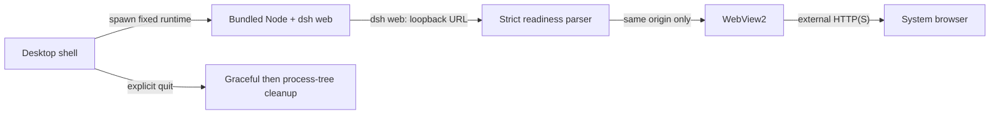

# DeepSeek Harness Desktop

<p align="center">
  
</p>

<p align="center">
  一个自包含、注重生命周期与安全边界的 DeepSeek Harness Windows 桌面封装。
</p>

<p align="center">
  <a href="https://dsh.cubee.chat/">官网</a> ·
  <a href="https://github.com/licn9901-arch/DSH-Desktop/releases">下载</a> ·
  <a href="https://github.com/licn9901-arch/DSH-Desktop/releases"></a>
  <a href="LICENSE"></a>
</p>

> [!IMPORTANT]
> 本项目由社区维护，不是 DeepSeek 官方产品，也不代表 DeepSeek 官方立场。

## 下载与安装

项目官网：[https://dsh.cubee.chat/](https://dsh.cubee.chat/)

从 [GitHub Releases](https://github.com/licn9901-arch/DSH-Desktop/releases) 下载最新的
`DeepSeek Harness Desktop_*_x64-setup.exe` 并安装。预览版仅支持 Windows 10 22H2 / Windows 11 x64。

`v0.1.0-preview.1` 未使用 Authenticode 签名，Windows SmartScreen 可能显示未知发布者提示。
请在 Release 页面核对同名 `.sha256` 文件后再运行安装包。

安装包已经内置 Node.js `22.22.3` 与 `@deepseek-ai/dsh 0.1.0-rc.6`，首次启动无需联网，
也不要求预装 Node、DSH 或 DeepSeek 官方桌面端。

## 主要功能

- 一键启动本地 `dsh web`，等待严格校验的回环地址后在 WebView2 中加载。
- 单实例运行：再次启动只恢复并聚焦现有窗口，不创建第二个 Host。
- 关闭主窗口后隐藏到系统托盘，任务继续运行；只有托盘“退出”才清理 Host。
- Host 正常退出等待 5 秒，超时后只强制结束本应用记录的进程树。
- 外部 HTTP/HTTPS 链接交给系统浏览器，危险 scheme 和跨源 WebView 导航被拒绝。
- Host 页面不获得任何 Tauri capability；本地启动页使用严格 CSP。
- 日志包含时间、级别与 PID，并进行敏感字段脱敏和 `5 MiB x 3` 轮转。

## 工作方式



应用执行以下命令，并让系统随机分配空闲端口：

```text
node --expose-internals <bundled-dsh>/lib/bin.js web --host 127.0.0.1 --port 0
```

就绪解析只接受以 `dsh web: ` 开头、主机为 `127.0.0.1` 或 `localhost`、带合法显式端口、
且没有凭据、路径、查询参数或片段的 HTTP 地址。冲突的重复地址会终止启动。

## 与上游项目的关系

本仓库只维护 Tauri 桌面壳、进程生命周期、自包含运行时、日志、安全边界和 Windows 发布流程。
它不修改 DSH Web UI，也不修改 Agent 核心能力。DSH 与其 Web 前端按
`runtime.lock.json` 固定版本并遵循各自上游许可证。

## 从源码开发

环境要求：PowerShell 7、Node.js `22.22.3`、Rust `1.94.1`、MSVC C++ Build Tools 和 WebView2。

```powershell
git clone https://github.com/licn9901-arch/DSH-Desktop.git
Set-Location DSH-Desktop
npm ci
.\dev.cmd
```

开发构建允许以下覆盖项，发布构建会忽略 Node 与 CLI 覆盖并只使用内置运行时：

| 环境变量 | 用途 |
|---|---|
| `DSH_DESKTOP_NODE_EXECUTABLE` | 仅开发模式：指定 Node 可执行文件 |
| `DSH_DESKTOP_CLI_ENTRY` | 仅开发模式：指定 DSH `lib/bin.js` |
| `DSH_DESKTOP_CWD` | 指定 Host 工作目录，默认用户目录 |
| `DSH_DESKTOP_READY_TIMEOUT_SECS` | 指定 Host 就绪超时秒数，默认 90 |

### 构建自包含安装包

```powershell
npm ci
npm run build
```

构建会按 `runtime.lock.json` 下载并校验官方 Node 压缩包，使用固定 `package-lock.json` 执行
`npm ci --omit=dev`，验证 Node、DSH CLI、Web 前端、版本和许可证后才调用 Tauri 打包。
暂存资源写入被 Git 忽略的 `src-tauri/resources`，NSIS 安装包输出到
`src-tauri/target/release/bundle/nsis`。

已有缓存时可离线暂存：

```powershell
pwsh -NoProfile -File .\scripts\stage-runtime.ps1 -Offline
```

## 测试与质量门禁

```powershell
npm run validate:icons
npm run lint
npm test
npm audit
Push-Location runtime-host
npm audit --omit=dev
Pop-Location
npm run coverage
npm run smoke
```

覆盖率门禁为 Host、运行时、生命周期、导航、日志和就绪解析核心模块行覆盖率不低于 80%；应用装配层由 Windows 冒烟覆盖。详细范围与流程见
[测试说明](docs/testing.md)。

## 日志与故障排查

日志位于 `%LOCALAPPDATA%\dsh-desktop\dsh-desktop.log`。

- 启动失败：查看日志中的 `level=ERROR`、Host PID 和真实退出码。
- 窗口关闭后仍有任务：这是关闭到托盘的预期行为，请从托盘菜单重新打开或显式退出。
- 构建提示运行时缺失或哈希不匹配：不要绕过校验，清理 `.runtime-cache` 后重新暂存。
- 安装器显示未知发布者：首个预览版未签名，请先核对 Release 提供的 SHA-256。

## 更新与卸载

首版不接入自动更新，请从 GitHub Releases 手动安装新版本。需要回滚时安装上一预览版本。
卸载器只删除应用安装文件；即使选择删除应用数据，也只清理桌面壳的日志目录，
不会删除 DSH 用户会话或配置。

## 当前边界

- 仅支持 Windows x64，不支持 macOS、Linux 或 ARM64。
- 不包含自动更新、开机自启、插件市场、手机远控或 Channels。
- 本机已有的 `0.1.0` 原型不保证原地升级；测试预览版前请先卸载原型并保留用户数据。

## 参与贡献

请先阅读 [贡献指南](CONTRIBUTING.md) 与 [安全政策](SECURITY.md)。问题反馈请附版本、复现步骤和
脱敏后的日志片段，不要提交 token、Cookie、密码或完整用户目录。

## 许可证

桌面壳代码采用 [MIT License](LICENSE)。内置 Node.js、DSH 和其他依赖的版本与许可证见
[第三方声明](THIRD_PARTY_NOTICES.md)，构建产物同时附带机器可读的第三方许可证清单。
