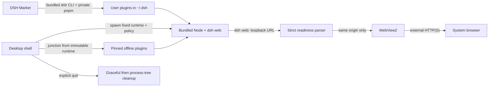

# DeepSeek Harness Desktop

<p align="center">
  <strong>简体中文</strong> · <a href="README.en.md">English</a>
</p>

<p align="center">
  
</p>

<p align="center">
  一个自包含、注重生命周期与安全边界的 DeepSeek Harness Windows 桌面封装。
</p>

<p align="center">
  <a href="https://dsh.cubee.chat/">官网</a> ·
  <a href="https://github.com/licn9901-arch/DSH-Desktop/releases">下载</a> ·
  <a href="https://github.com/licn9901-arch/DSH-Desktop/releases"></a>
  <a href="LICENSE"></a>
</p>

> [!IMPORTANT]
> 本项目由社区维护，不是 DeepSeek 官方产品，也不代表 DeepSeek 官方立场。

## 下载与安装

项目官网：[https://dsh.cubee.chat/](https://dsh.cubee.chat/)

从 [GitHub Releases](https://github.com/licn9901-arch/DSH-Desktop/releases) 下载最新的
`DeepSeek Harness Desktop_*_x64-setup.exe` 并安装。预览版仅支持 Windows 10 22H2 / Windows 11 x64。

`v0.1.0-preview.9` 未使用 Authenticode 签名，Windows SmartScreen 可能显示未知发布者提示。
请在 Release 页面核对同名 `.sha256` 文件后再运行安装包。

安装包已经内置 Node.js `22.22.3`、`@deepseek-ai/dsh 0.1.0-rc.6`、
`dshmarket 1.10.0` 与 `pnpm 10.34.5`，首次启动无需联网，也不要求预装 Node、DSH、pnpm
或 DeepSeek 官方桌面端。

## 主要功能

- 一键启动本地 `dsh web`，等待严格校验的回环地址后在 WebView2 中加载。
- 单实例运行：再次启动只恢复并聚焦现有窗口，不创建第二个 Host。
- 关闭主窗口后隐藏到系统托盘，任务继续运行；只有托盘“退出”才清理 Host。
- 托盘可串行重启 DSH 服务；新 PID 和随机端口就绪后自动恢复 WebView。
- Host 正常退出等待 5 秒，超时后只强制结束本应用记录的进程树。
- 外部 HTTP/HTTPS 链接交给系统浏览器，危险 scheme 和跨源 WebView 导航被拒绝。
- Host 页面不获得任何 Tauri capability；本地启动页使用严格 CSP。
- 日志包含时间、级别与 PID，并进行敏感字段脱敏和 `5 MiB x 3` 轮转。

## 内置插件

`v0.1.0-preview.9` 将以下插件固定版本后随安装包离线交付。桌面端只维护带 marker 的托管安装，
不会覆盖用户自行安装的同名插件，也会保留用户主动禁用的状态。

| 插件 | 版本 | 默认行为与权限 |
|---|---:|---|
| [`dsh-at-file`](https://github.com/omdsh-dev/dsh-at-file) | 0.6.0 | 搜索工作区路径，只插入相对路径引用，不注入文件内容 |
| [`@omdsh-dev/dsh-genui`](https://github.com/omdsh-dev/dsh-genui) | 0.8.4 | 本地渲染 GenUI、Mermaid 和 Three.js；action 会作为消息回传模型 |
| [`dsh-better-sidebar`](https://github.com/omdsh-dev/DSH-better-sidebar) | 0.12.2 | 可操作文件、Git 和本机 PTY；模型终端工具保持关闭，首次托管安装关闭 HTTP/HTTPS 接管 |
| [`@linxin666/dsh-skins`](https://github.com/zhu1090093659/dsh-web-ui) | 0.1.17 | 只安装 Skin Center 与聚合皮肤，不安装 Web UI 全家桶；设置左侧“主题”可试穿、应用和恢复 |
| [`@vectorize-io/hindsight-coding-agents`](https://github.com/vectorize-io/hindsight/tree/main/hindsight-integrations/coding-agents) | 0.3.4 | 设置左侧“项目记忆”可配置 Cloud/自托管服务、凭据和项目 opt-in；未启用项目不记录也不上传 |
| [`@liustack/modlens`](https://github.com/liustack/modlens) | 3.16.7 | 提供图片读取和结构化视觉结果；不预置密钥、视觉端点或 Agent CLI |
| [`@cubee-slide/skills-mcp-manager`](https://www.npmjs.com/package/@cubee-slide/skills-mcp-manager) | 0.2.3 | 桌面长期维护版；统一 Skills/MCP 界面与按钮，MCP 只保留 JSON 配置；`env`/`headers` 明文存于 `~/.dsh/mcp.json` |

桌面自有 `@dsh-desktop/theme-settings` 提供“预置插件”“项目记忆”和“主题”三个设置一级入口。“预置插件”
只切换白名单 package bundle，不卸载文件、不修改 dependencies、不调用 pnpm；保存后通过托盘
“重启 DSH 服务”生效。官方 bundle、Market 与桌面控制 bundle 自身不可关闭，未知用户 bundle
不会被修改。

GenUI 的锁定 `SKILL.md` 首次启动会写入 `$DSH_HOME/skills/genui/SKILL.md`，只作用于 DSH。
已有非托管同名 Skill 不覆盖；托管文件未修改时会随版本升级，用户修改或删除后保留用户选择。

DSH Market `1.10.0` 以原始包名作为桌面运行时 bundle 固定交付，不写入用户 profile dependencies，也不能由
市场升级或卸载。它使用 curated registry 搜索插件，并通过内置 DSH CLI 与私有 pnpm 在
`~/.dsh/profiles/web` 安装、更新和卸载用户插件；离线可浏览内置快照，但安装、更新和可靠的版本检查需要网络。
桌面端在 Market 前加载受保护的 Runtime Services，始终使用内置 pnpm `10.34.5`。只有 pnpm 明确报告
历史 profile 的 modules/hoist major 不兼容时，才会按字节快照控制文件、原子备份旧依赖树、重建一次并
重试原操作一次；失败恢复旧状态，不使用 `--force`、全局 pnpm 或其他 major。第三方安装脚本在 profile
外产生的副作用不属于该事务边界。

第三方插件与桌面应用拥有相同主机权限，目前没有包签名验证、权限清单或进程级沙箱。npm
预构建包可以直接安装；需要 `prepare`、`allowBuilds` 等脚本的 GitHub 源必须逐包明确确认。
插件需要重启才能生效时，请使用托盘“重启 DSH 服务”，Market 内部重启已被桌面 policy 禁用。

## 工作方式



应用执行以下命令，并让系统随机分配空闲端口：

```text
node --expose-internals <bundled-dsh>/lib/bin.js web --patch <desktop-policy> --host 127.0.0.1 --port 0
```

桌面适配器在核心 `webServer` 与 `webRuntime` 可用后输出 `dsh desktop-core: `，桌面壳立即
导航；全部 Loader 插件完成后，上游继续输出 `dsh web: ` 并提交插件事务。旧 Host 只输出
`dsh web: ` 时同时视为两级就绪。两个信号都只接受回环主机、合法显式端口且不带凭据、
路径、查询参数或片段的 HTTP 地址；冲突地址会终止启动。

## 与上游项目的关系

本仓库只维护 Tauri 桌面壳、进程生命周期、自包含运行时、日志、安全边界和 Windows 发布流程。
它不修改 DSH Web UI，也不修改 Agent 核心能力。DSH、DSH Market、pnpm 与 Web 前端按
`runtime.lock.json` 固定版本并遵循各自上游许可证。

## 从源码开发

环境要求：PowerShell 7、Node.js `22.22.3`、Rust `1.94.1`、MSVC C++ Build Tools 和 WebView2。

```powershell
git clone https://github.com/licn9901-arch/DSH-Desktop.git
Set-Location DSH-Desktop
npm ci
.\dev.cmd
```

开发构建允许以下覆盖项，发布构建会忽略 Node 与 CLI 覆盖并只使用内置运行时：

| 环境变量 | 用途 |
|---|---|
| `DSH_DESKTOP_NODE_EXECUTABLE` | 仅开发模式：指定 Node 可执行文件 |
| `DSH_DESKTOP_CLI_ENTRY` | 仅开发模式：指定 DSH `lib/bin.js` |
| `DSH_DESKTOP_CWD` | 指定 Host 工作目录，默认用户目录 |
| `DSH_DESKTOP_USER_HOME` | 仅开发模式：覆盖第三方用户配置目录，供隔离 smoke 使用 |
| `DSH_DESKTOP_CORE_READY_TIMEOUT_SECS` | 核心页面就绪超时秒数，默认 60 |
| `DSH_DESKTOP_PLUGIN_READY_TIMEOUT_SECS` | 全部插件完成超时秒数，默认 30 |
| `DSH_DESKTOP_READY_TIMEOUT_SECS` | 兼容旧配置，同时作为上述两个超时的回退值 |

### 构建自包含安装包

```powershell
npm ci
npm run build
```

当前 `npm run build` 保持 legacy 打包，确保 payload 灰度期间可随时回退。payload preview 使用：

```powershell
npm run package:payload
npm run verify:payload
npm run build:payload
```

`preview.8` 和 `preview.9` 的默认 `build` 都必须保持 legacy；两轮公开 payload preview 的完整门禁通过后，
`preview.10` 才允许切换默认 payload。preview.7 只作为固定 SHA-256 的 legacy 升级基线，不能计入 payload 灰度。
preview.8 第一轮门禁已通过，最终 payload 安装器为 92.79 MiB，20 对安装版 warm P95 为 legacy 5,533 ms、
payload 5,547 ms。preview.9 第二轮门禁也已通过，solid LZMA 安装器为 79.09 MiB，warm P95 为
legacy 4,999 ms、payload 4,601 ms；默认构建仍在 preview.9 保持 legacy，preview.10 才允许切换。

构建会按 `runtime.lock.json` 下载并校验官方 Node 压缩包，以及 DSH、Market、pnpm 的 npm
integrity，并按 `plugins.lock.json` 校验 9 个托管 bundle 与 1 个托管 Skill
归档与 npm integrity。三组固定 lockfile 分别执行 `npm ci`；插件组额外使用
`--omit=dev --ignore-scripts`。Node、DSH CLI、Web 前端、插件本地资产、PTY 和许可证全部验证后
才调用 Tauri 打包。
暂存资源写入被 Git 忽略的 `src-tauri/resources`，NSIS 安装包输出到
`src-tauri/target/release/bundle/nsis`。

Node Host 与内置插件预编译、依赖裁剪、单一 pnpm 10、ZIP payload、原子 provision 和灰度状态见
[桌面运行时与安装包优化方案](docs/runtime-packaging-optimization.md)。

已有缓存时可离线暂存：

```powershell
pwsh -NoProfile -File .\scripts\stage-runtime.ps1 -Offline
pwsh -NoProfile -File .\scripts\stage-plugins.ps1 -Offline
```

## 测试与质量门禁

```powershell
npm run validate:icons
npm run lint
npm test
npm audit
Push-Location runtime-host
npm audit --omit=dev
Pop-Location
Push-Location plugin-runtime
npm audit --omit=dev
Pop-Location
npm run coverage
npm run smoke
npm run smoke:startup
# 完整 preview 门禁，安装器参数见 docs/testing.md
npm run release:gate -- -LegacyInstaller '<preview.7 installer>' -PayloadInstaller '<current payload installer>'
```

覆盖率门禁为 Host、运行时、生命周期、导航、日志和就绪解析核心模块行覆盖率不低于 80%；应用装配层由 Windows 冒烟覆盖。详细范围与流程见
[测试说明](docs/testing.md)。

## 日志与故障排查

日志位于 `%LOCALAPPDATA%\dsh-desktop\dsh-desktop.log`。

- 启动失败：查看日志中的 `level=ERROR`、Host PID 和真实退出码。
- 市场显示“状态未知”：表示 registry 或版本检查失败，不等同于“已是最新”。
- 插件安装后未生效：从托盘选择“重启 DSH 服务”，不要依赖 Market 内部重启。
- 预置插件开关：打开“设置 → 预置插件”；开关保存后需从托盘重启 DSH 服务。
- 项目记忆：打开“设置 → 项目记忆”；配置服务与 Token 后，只开启需要记忆的项目并重启 DSH 服务。
- Skills 与 MCP：打开“设置 → 技能与 MCP”；MCP 服务统一使用 JSON 编辑器配置。
- 主题切换：打开“设置 → 主题”；该入口由桌面适配器提供，具体皮肤 UI 与 Host API 仍来自 Skin Center。
- 窗口关闭后仍有任务：这是关闭到托盘的预期行为，请从托盘菜单重新打开或显式退出。
- 构建提示运行时或插件缺失、哈希不匹配：不要绕过校验，清理对应 `.runtime-cache` 后重新暂存。
- 安装器显示未知发布者：首个预览版未签名，请先核对 Release 提供的 SHA-256。

## 更新与卸载

首版不接入自动更新，请从 GitHub Releases 手动安装新版本。需要回滚时安装上一预览版本。
卸载器始终删除桌面托管 runtime；只有选择删除应用数据时才继续清理桌面壳日志等 LocalAppData。
它不会删除 `~/.dsh`、DSH 用户会话、用户插件或业务配置。

## 当前边界

- 仅支持 Windows x64，不支持 macOS、Linux 或 ARM64。
- 不包含自动更新、开机自启、插件签名验证、权限沙箱、手机远控或 Channels。
- 本机已有的 `0.1.0` 原型不保证原地升级；测试预览版前请先卸载原型并保留用户数据。

## 参与贡献

请先阅读 [贡献指南](CONTRIBUTING.md) 与 [安全政策](SECURITY.md)。问题反馈请附版本、复现步骤和
脱敏后的日志片段，不要提交 token、Cookie、密码或完整用户目录。

## 许可证

桌面壳代码采用 [MIT License](LICENSE)。内置 Node.js、DSH 和其他依赖的版本与许可证见
[第三方声明](THIRD_PARTY_NOTICES.md)，构建产物同时附带机器可读的第三方许可证清单。
