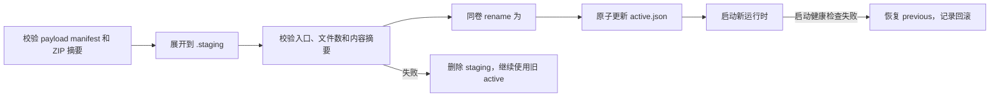

# 桌面运行时与安装包优化方案

本文定义 DeepSeek Harness Desktop 自包含运行时的目标交付方式。方案解决两个相互关联的问题：
构建阶段需要让 NSIS 遍历并压缩数万个小文件，以及桌面端为了兼容历史 profile 同时交付三套
pnpm。本文是后续实现、测试和发布验收的唯一设计依据；完成相应阶段前，README 中描述的现有
运行时结构仍然有效。

## 现状与根因

2026-08-17 对正式暂存资源的测量结果如下。大小是文件内容总和，不包含文件系统簇浪费。

| 资源 | 文件数 | 字节数 | 约合大小 |
|---|---:|---:|---:|
| Host | 35,956 | 344,045,447 | 328.1 MiB |
| 内置插件 | 11,459 | 153,325,311 | 146.2 MiB |
| Node.js | 3 | 87,118,892 | 83.1 MiB |
| 合计 | 47,418 | 584,489,650 | 557.4 MiB |

当前 `stage-runtime.ps1` 和 `stage-plugins.ps1` 分别执行完整的生产依赖安装，再把 Host
`node_modules`、插件依赖和 GitHub 源码归档展开到 `src-tauri/resources`。Tauri 随后为这些
文件生成约 4.74 万条 NSIS `File` 指令，并使用 solid LZMA 再压缩。瓶颈不是最终安装包大小，
而是深目录枚举、小文件读取、NSIS 脚本生成以及单流 solid LZMA 的重复压缩工作。

Host 中三套 pnpm 的当前占用如下：

| 运行时 | 文件数 | 字节数 |
|---|---:|---:|
| pnpm 9.15.9 | 902 | 17,420,406 |
| pnpm 10.33.2 | 1,076 | 18,936,903 |
| pnpm 11.22.0 | 891 | 38,187,995 |

只保留 pnpm 10 可直接减少 1,793 个文件和约 53.0 MiB。三版本并不是 DSH CLI 或某个插件的
运行要求：DSH CLI 最终调用 PATH 中的 `pnpm`，DSH Market 负责插件操作和已知错误恢复。
真正需要处理的是不同 pnpm major 写入的 modules/hoist 元数据不兼容，而不是长期保留三套
包管理器。

### 为什么插件不是前端项目的几 MiB

当前 `@deepseek-ai/dsh-web-frontend` 本身约 4.41 MiB，前端项目的直觉没有错。问题在于桌面
发布链路交付的不是前端 bundle，而是 Node Host、插件服务端入口、客户端 bundle、native 模块
和完整生产依赖树的混合物。

插件客户端其实已经有 bundle 产物。例如 Skills/MCP Manager 的 `lib/client.js` 已包含 Lucide
代码，侧栏的 `client-editor.js` 和 `client-terminal.js` 已包含 CodeMirror、Xterm 等代码；但
`npm ci` 仍会按插件的 `dependencies` 再安装这些包。`npm ci --omit=dev` 只跳过开发依赖，不会
进行 tree-shaking、模块合并或删除发布包中的 map、类型和调试文件。

当前实现还有三个放大点：

- [`stage-plugins.ps1`](../scripts/stage-plugins.ps1) 对 GitHub tarball 和本地插件使用递归复制，
  不使用 lock 中的 `requiredFiles` 作为复制白名单；
- `requiredFiles` 目前只在 [`plugins.rs`](../src-tauri/src/plugins.rs) 中做存在性校验，不能证明
  未列出的文件不会进入安装包；
- 安装启动准备会把整个 `resources/plugins/node_modules` 再物理复制到用户托管 store，然后通过
  junction 挂载。安装目录、用户 store 和暂存目录因此会重复承载同一份小文件树。

### 瘦身审计结果

以下数据来自 2026-08-17 的 Windows x64 暂存资源。不同项存在重叠，不能直接相加；它们用于确定
优先级，不是最终可节省量的承诺。

| 对象 | 当前占用 | 已确认的浪费或边界 |
|---|---:|---|
| `node-pty`（插件） | 61.38 MiB | 52.76 MiB 是 PDB；Windows x64 非 PDB 预编译文件约 2.45 MiB |
| `lucide-react` | 27.25 MiB / 3,521 文件 | 客户端 bundle 已包含使用到的代码，生产依赖树仍完整交付 |
| CodeMirror、Lezer、RxJS、Xterm | 14.60 MiB / 3,173 文件 | 侧栏客户端已内联，服务端入口不应带整套客户端依赖 |
| Hindsight 通用依赖 | 6.69 MiB / 1,869 文件 | `dist/dsh.js` 的外部 import 主要是 Node 内置模块，其他 Agent 集成不属于 DSH 入口闭包 |
| Host 与插件重复包 | 97 个包 / 76.64 MiB | 两次独立 `npm ci` 产生重复版本，需共享或编译进各自 bundle |
| Host 非发布内容 | source map 42.43 MiB、类型 26.36 MiB、测试/源码路径 26.91 MiB | 这些数字有重叠；应生成独立 debug artifact，不能进入默认安装资源 |

`node-pty` 还带有 ARM64、Darwin、源码、测试和 `third_party` 内容；桌面发布只支持 Windows x64，
因此应只保留按 `process.platform`/`process.arch` 实际加载的 native 闭包。Host 中同版本的
`node-pty` 也应与侧栏共用一份，但共享必须通过明确的 runtime external/链接布局实现，不能简单
删除插件目录后依赖 Node 的偶然搜索路径。

### 瘦身优先级

1. 先生成“运行时依赖闭包”而不是复制 npm 包目录：分别产出 Host server、插件 server、客户端
   bundle、native external、Skill/patch/assets 和许可证清单。
2. 将已经编译进客户端 bundle 的 Lucide、CodeMirror、Lezer、RxJS、Xterm 等从生产依赖树移出；
   如果服务端确实需要某个包，保留服务端最小入口并通过 import 追踪验证。
3. 为 `node-pty` 做 Windows x64 专用裁剪：删除 PDB、ARM64/Darwin、源码、测试和未使用的第三方
   构建文件；Host 与侧栏共用同一份 native external。
4. Hindsight、ModLens 等插件按 DSH 入口单独打包，不能因为 npm 包同时发布其他 Agent/CLI 集成
   就把那些入口一起带入桌面安装包。
5. Host 按 esbuild metafile 和动态加载清单裁剪 map、声明文件、测试和多平台依赖；source map
   只作为发布诊断附件，不进入安装器。
6. 最后再启用 ZIP payload 和 NSIS `compression: none`，否则只是把未裁剪的依赖树换一种容器，
   不能解决安装包体积和首次复制问题。

阶段二的初始目标是：内置插件资源从 146.2 MiB 降到 40 MiB 以下、文件数降到 3,000 以下；
目标必须在真实 Host 启动、侧栏终端、GenUI、Hindsight、ModLens 和 Skills/MCP smoke 通过后
才算成立。这个目标不包含 Node.js 本体，也不包含用户通过 Market 安装的插件。

## 架构决策

### 预编译并裁剪 Node Host

Node Host 使用 esbuild 按 Node.js 22、Windows x64、ESM 目标生成固定入口。构建结果包含可静态
解析的 JavaScript 依赖；以下内容保留为 external，并随 Host 资源显式交付：

- Node.js 内置模块；
- `.node` 原生扩展及其运行时 DLL，例如 `node-pty`、`sharp`；
- Cordis/DSH 按包名或配置动态加载的模块；
- 运行时确实读取的模板、协议文件、许可证和静态资产。

构建脚本必须输出 esbuild metafile 和 external 清单。暂存过程根据清单生成最小运行时目录，
禁止用“删除所有 `.map`/`.d.ts`”一类无上下文规则直接裁剪。验证脚本从真实 CLI 入口启动 Host，
覆盖 DSH Web、Market、PTY、图片处理和动态插件加载后，才允许新的 external 清单进入 lockfile。

### 内置插件只交付发布内容

每个 `plugins.lock.json` 条目增加交付描述，至少包含编译入口、运行时资产、native external 和
许可证来源。npm 包使用其发布 fileset；GitHub 来源在受控构建目录中完成预编译，只复制下列内容：

- `package.json` 中声明的运行入口和 DSH/Cordis manifest；
- 编译后的 JavaScript、CSS 与必要图片；
- 运行时需要的模板、patch、Skill 和许可证；
- 经验证仍需动态解析的生产依赖和 Windows x64 原生文件。

源码、测试、示例、开发配置、声明文件、source map、其他平台原生文件和完整 Git 仓库元数据不进入
安装资源。`lucide-react`、`rxjs` 等公共纯 JavaScript 依赖优先编入各插件产物；无法安全编入时，
才进入内置插件共享 external 目录。用户通过 Market 安装的插件仍位于用户 profile，其依赖树不与
内置插件合并。

### 用 ZIP payload 替代小文件资源

资源包保持真实格式，不改名为 `.dll`。文件扩展名不会减少 I/O 或提高压缩效率，伪装为 DLL 还会
混淆可执行模块与数据资源的校验、安全策略和故障诊断。

发布构建只向 Tauri resources 交付以下四个文件：

```text
payload/
  payload-manifest.json
  node-runtime.zip
  host-runtime.zip
  builtin-plugins.zip
```

`node-runtime.zip` 复用已校验的官方 Node.js ZIP；Host 与插件 ZIP 使用固定文件顺序、固定时间戳和
Deflate level 6 生成，以保证相同输入得到相同 SHA-256。`payload-manifest.json` 至少包含：

```json
{
  "schemaVersion": 1,
  "payloadVersion": "<desktop-version>-<digest>",
  "nodeVersion": "22.22.3",
  "pnpmVersion": "10.33.2",
  "artifacts": [
    {
      "id": "host",
      "file": "host-runtime.zip",
      "sha256": "<sha256>",
      "size": 0,
      "target": "host"
    }
  ]
}
```

构建阶段逐包验证 SHA-256、未压缩大小、文件数量和必需入口。展开阶段拒绝绝对路径、`..`、符号链接、
重复目标、超出 manifest 上限的文件数或未压缩大小，避免路径穿越和 ZIP bomb。

### 原子化安装、升级和回滚

桌面程序提供无窗口的 `--provision-runtime` 内部命令。NSIS 复制四个 payload 文件后调用该命令；
开发构建或安装阶段未执行时，应用首次启动执行同一兜底路径。



运行时目录位于 `%LOCALAPPDATA%\dsh-desktop\runtime`，只保留 active 与 previous 两个完整版本。
升级不得覆盖正在使用的目录。`active.json` 保存 payload digest、版本和路径；`previous.json` 只用于一次
自动回滚。清理只删除不再被两个指针引用的桌面托管运行时，绝不删除 `~/.dsh`、用户插件、会话或配置。

NSIS 输入已经是压缩归档，因此将 `bundle.windows.nsis.compression` 固定为 `"none"`，避免再次执行
solid LZMA。若安装包超过 100 MiB，只能通过裁剪依赖或调整 ZIP 内容解决，不得恢复多小时 LZMA 作为
默认方案。Tauri 对 `none`、`zlib`、`bzip2` 和 `lzma` 的支持见
[NSIS compression 配置](https://v2.tauri.app/reference/config/#nsiscompression)。

## 固定 pnpm 10

### 单版本边界

桌面运行时精确固定 `pnpm@10.33.2`，不使用范围版本。实现完成后删除：

- `pnpm-9`、pnpm 11 依赖、integrity 和 lock 条目；
- `SUPPORTED_PNPM_MAJORS`、`selectPnpmMajor`、`profilePnpmMajor`；
- `toolchains/pnpm-9`、`toolchains/pnpm-11` 及多版本测试；
- README、安装器 smoke 和第三方清单中的三版本描述。

`runtime-services` 始终把唯一的内置 pnpm 10 shim 放在 Market 子进程 PATH 首位。不得回退到用户全局
pnpm，不得在运行时下载另一个 major。新 profile 和空 profile 都由 pnpm 10 初始化。

### 历史 profile 兼容

启动应用、读取 profile 和加载已有插件时不运行 pnpm，也不迁移 profile。只有用户主动安装、升级或
删除插件时，才允许进入以下恢复流程：

1. 使用固定 pnpm 10 执行原插件操作。
2. 仅当输出包含 `ERR_PNPM_PUBLIC_HOIST_PATTERN_DIFF` 或 pnpm 明确报告 modules 目录由不兼容版本
   创建时，进入一次兼容恢复。
3. 在同一 profile 卷内将旧 `node_modules` 原子改名为恢复备份，并备份 `pnpm-lock.yaml`；不得修改
   `package.json`、`pnpm-workspace.yaml`、Cordis 配置或 bundle 列表。
4. 执行 `pnpm install --force --no-frozen-lockfile`。pnpm 10 官方文档明确说明 `--force` 会重建由
   不兼容 pnpm 创建的 lockfile 或 modules 目录，见
   [pnpm 10 install 文档](https://pnpm.io/10.x/cli/install#--force)。
5. 重建成功后重试原操作一次；成功后删除恢复备份。
6. 重建或重试失败时，删除新生成的依赖树，恢复旧 `node_modules` 和 lockfile，并返回原始命令、退出码、
   已识别错误类型和日志位置。不得循环重试或切换 pnpm major。

现有 DSH Market `withHoistRecovery` 已能识别 hoist pattern drift，但当前重建命令缺少 `--force`。
删除 pnpm 9/11 前，必须先将 Market 命令层升级到上述事务式恢复实现并完成 fixture 验证；这是阶段一的
发布门禁，不允许用 profile 启动迁移代替。

## 分阶段实施

### 阶段一：固定 pnpm 10

- 先补 pnpm 9、10、11 profile fixture，锁定依赖声明和业务配置不变的断言。
- 完成 Market 一次性恢复、失败还原和诊断日志，再删除 pnpm 9/11 与版本选择逻辑。
- 更新 runtime lock、npm lock、许可证清单、安装器 smoke 和 README 当前版本说明。
- 重新测量 Host 文件数与大小；预期至少减少 1,793 个文件和约 53 MiB。

### 阶段二：Host 与内置插件预编译、裁剪

- 引入可复现的 Host bundle、插件 bundle、metafile 和 external allowlist。
- `stage-runtime.ps1` 与 `stage-plugins.ps1` 从完整依赖安装改为“受控构建目录安装，再复制发布闭包”。
- `verify-runtime.ps1`、`verify-plugins.ps1` 校验真实入口、native 模块、资产、许可证和动态加载。
- 对每个插件记录裁剪前后文件数、大小和功能 smoke；任何缺失运行时文件都阻止发布。

### 阶段三：ZIP payload 与快速 NSIS

- 生成三个确定性 ZIP 和 payload manifest，Tauri resources 不再包含原始 `node_modules` 树。
- 实现 provision、active/previous 指针、失败清理和自动回滚。
- 将 NSIS compression 固定为 `none`，安装器只处理四个 payload 文件和桌面程序自身文件。
- 完成冷安装、覆盖升级、回滚、卸载和资源损坏测试后，移除旧的小文件暂存路径。

每个阶段单独提交并可独立回退。阶段二不能绕过阶段一的 pnpm 兼容门禁；阶段三必须在阶段二的真实
运行时 smoke 全部通过后启用。

## 测试与验收

### 功能与兼容性

- pnpm 10 profile 可以完成 Market 安装、升级和删除，且始终使用内置 `10.33.2`。
- pnpm 9/11 fixture 的首次插件操作只重建一次依赖树，操作成功后业务配置字节不变。
- 恢复失败 fixture 能还原旧依赖树和 lockfile；不循环重试、不访问全局 pnpm。
- Host、DSH Web、Market、9 个内置 bundle、用户 Market 插件、PTY、图片处理和 Skill 均通过真实入口 smoke。
- 冷安装、覆盖升级、损坏 ZIP、摘要不匹配、展开中断和新运行时启动失败均能拒绝或回滚。
- 卸载和失败恢复不得删除 `~/.dsh`、用户插件、会话或配置。

### 性能指标

| 指标 | 验收值 |
|---|---:|
| 相同 lock、warm cache 的重复打包 | 不超过 10 分钟 |
| 已有下载缓存、清空暂存产物的冷暂存与打包 | 不超过 20 分钟 |
| NSIS `File` 指令 | 不超过 100 条 |
| 安装资源文件数 | 相对当前减少至少 90% |
| NSIS 安装包 | 不超过 100 MiB |
| 已安装版本启动耗时 P95 | 不劣于改造前基线 |

网络下载时间不计入冷构建指标，但必须单独记录。构建日志分别输出依赖解析、Host bundle、插件 bundle、
ZIP、Tauri 编译、NSIS 和 provision 耗时，以及各阶段输入/输出文件数与字节数。验收报告必须附相同机器、
相同 lockfile、相同 Windows Defender 状态下的改造前后数据，不能只比较最终安装包大小。

## 非目标与约束

- 本方案不改变 DSH Web、Agent 能力、用户 profile schema 或插件业务配置。
- 本方案不把用户插件预编译进桌面安装包，也不承诺插件安装离线可用。
- 本方案不引入运行时静默下载、全局 pnpm、profile 启动迁移或第二套包管理器。
- 依赖裁剪不能移除许可证、NOTICE、原生运行文件或动态加载所需资产。
- ZIP 摘要保证构建产物完整性，不替代 Authenticode、插件签名或进程级沙箱。
